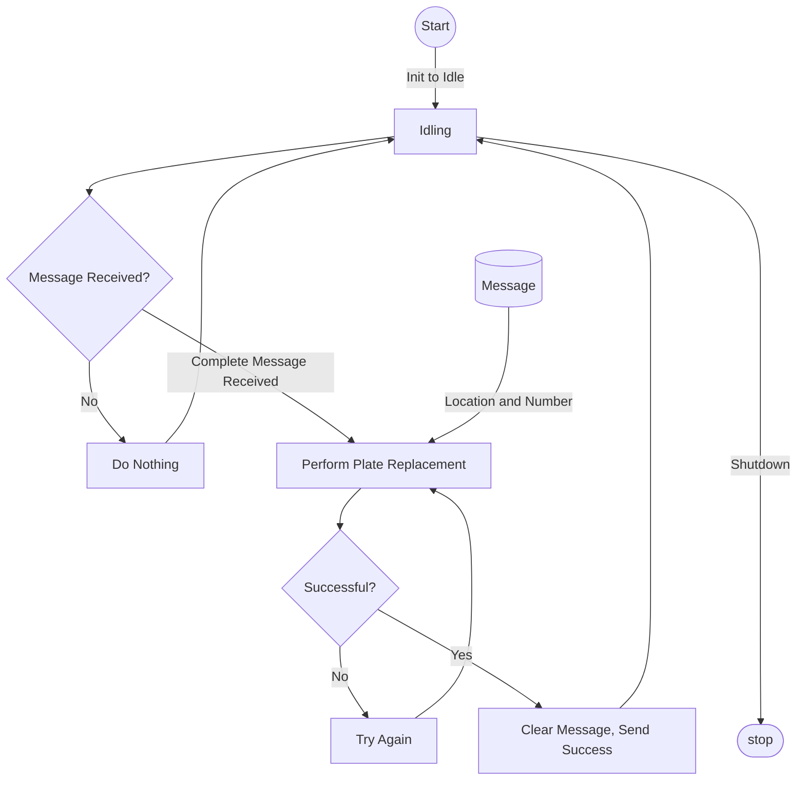

Status: #literature 
Tags: `=this.file.tags`
Links: `=this.file.outlinks`

---

```mermaid

flowchart TD 
A@{ shape: circle, label: "Start" } --> |Init to Idle| G
G[Idling] --> B{Message Received?} 
B --> |No| E[Do Nothing] --> G 
B --> |Complete Message Received| C[Perform Plate Replacement] 
D@{ shape: cyl, label: "Message" } --> |Location and Number| C 
C --> F{Successful?} 
F --> |No| H[Try Again] --> C 
F --> |Yes| I[Clear Message, Send Success] 
I --> G 
G ----->|Shutdown| J([stop])
```
# References
