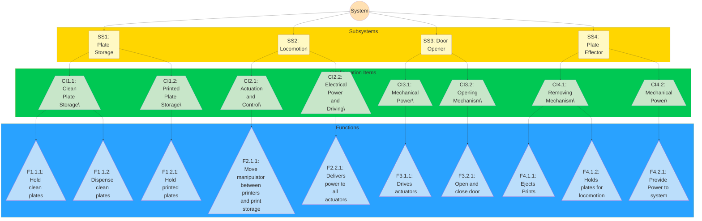

Status: #literature 
Tags: `=this.file.tags`
Links: `=this.file.outlinks`

---
A diagram of the relevant systems, subsystems, and functions in our system:

Concepts, see [Meeting 5](https://www.notion.so/Meeting-5-26f179526f308065bbf6c12aca77c5dc?pvs=21) listed per CI:

- 1.1: carousel, Pez-dispenser type, track (for both)
- 1.2: stacked shelf, slanted shelf
- 2.1: gantry system, Roomba, cable-driven, drone
- 2.2: stepper driver, DC power supply, battery
- 3.1: individual motor, motor on effector, linear actuator inside
- 3.2: motor-driven lever, spinning star, custom handle
- 4.1: magnet/electromagnet, lever-type with top gripper, individual eject, suction cup
- 4.2: EM driver, servo, stepper motor, print head itself (modified), nothing

In image form

![[Pasted image 20251005052429.png]]
# References
